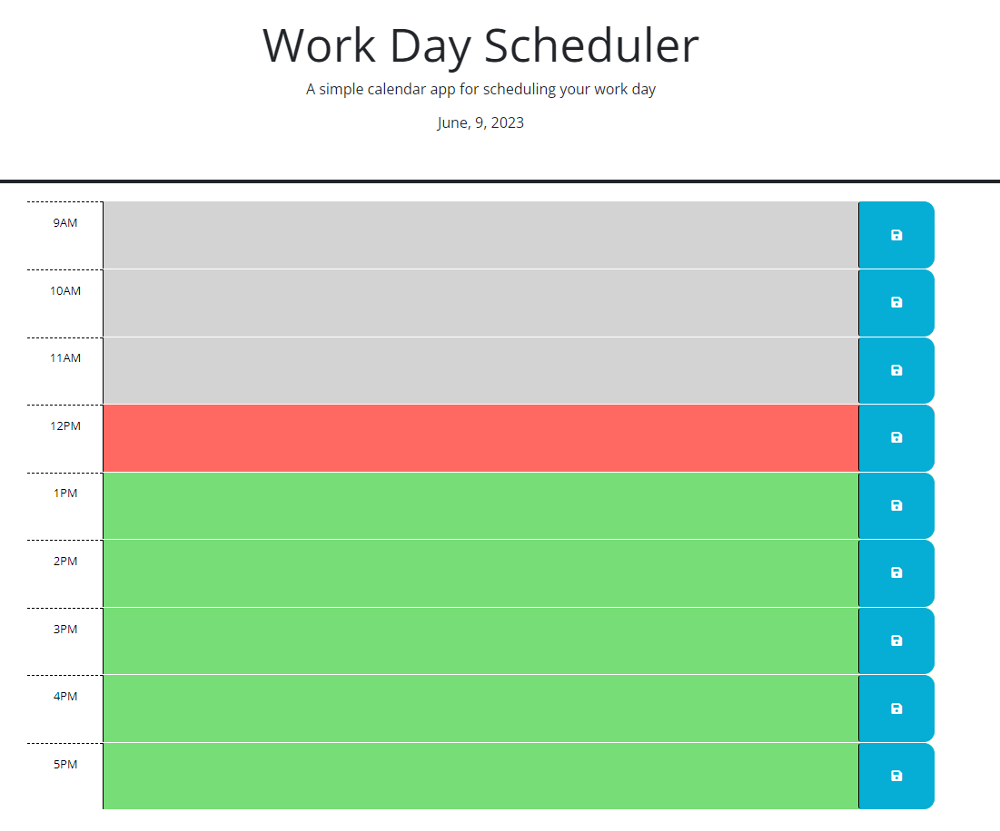

# day-scheduler

## Description

The goal of this project was to create a daily calendar application that allows the user to save events that are happening that day by the hour. As the day progresses, time passed will be greyed out, current time will be red, and future time will be green. This webpage is powered by jQuery and uses the day.js library to update date and time.

## Link to Live Webpage

https://rylee94.github.io/day-scheduler/

## Link to Repository

https://github.com/Rylee94/day-scheduler
